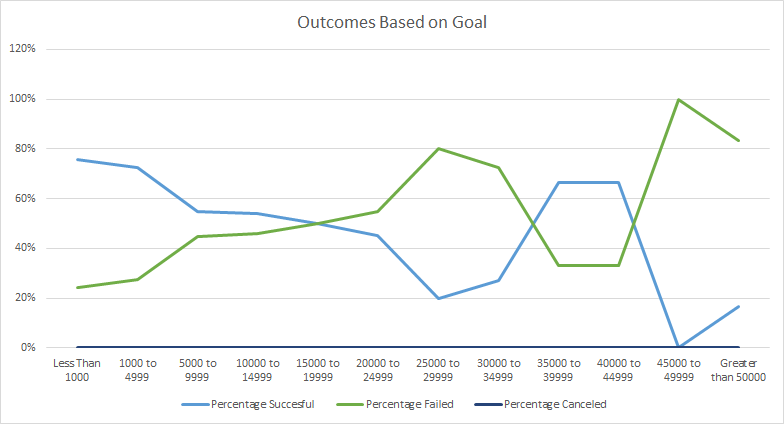
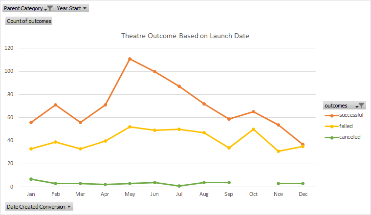

# An Analysis of Kickstarter Campaigns

## Overview

We are tasked with the thrilling challenge of helping Louse make desicions to launch her new Play. This brings up certain questions such as "what countries should it be launched in", "what kind of budget(goal) should she aim for", "how do Plays usually fair in Kickstarter" and more. It is our job to create analysis and usuable data visualization tools in order to help Louise come up with the right desicion during her launch. The ultimate data visualization we are able to provide Louise with is how Plays have performed in kickstarter based on their goal. Out of all the information, this is the primary tool she should use to start her project in kickstarter. Chart displayed below

  

### Analysis
We began our analysis by creating some more usable data. This includes further splitting Category column into its own "Parent Category" and "Subcategory" column for futher control over our scope of the data. We also needed to adjust the dates for deadline and launch so that we are able to use them in analysis. Not only did this allow us to create line charts over time (line plots) it also allowed us to create a "year" column/filter so that we can visualize the data month by month throughout the years (shown below). Since I am very experience in excel and use it in my everyday life I did not really experience any challenges in this Project but I could see where some would come up. Pivot tables can be pretty tricky for a beginner and being able to manipulate the data and add rows/columns/filters/values in the correct order is vital in creating a layered pivotal table. In addition this was a lot of data with a lot of columns, it can be confusing to traverse through the mini analysis we performed some only using minimal columns of the total data set. Another limitation for some could be the fact we are using different versions of excel and the examples may not have matched up completly with your actual excel (I experienced this problem a couple times)

  

### Questions

#### What are two conclusions you can draw about the Outcomes based on Launch Date?

Campaigns launched in June and May were more succesful
Campaigns launched in January July and December had a much greater chance of failure

#### What can you conclude about the Outcomes based on Goals?

Campaigns with more realistic Goals have a higher chance of being succesful. The higher the goal does not mean a more succesful Campaign

#### What are some limitations of this dataset?
First off THE 'mi8' RISES | The Best Wireless Duo Stereo Sound System should be removed because it is a huge outlier (had a $1 goal) 

Also there is limited amount of data from 2009-2012 (around 500) compared to recent 4 years (3.3k+), skews any historical trends to be based on more recent findings
We could also find data outside of kickstarter and compare our findings (such as Indigogo) maybe plays/theatre were more succseful on different crowdfunding websites

#### What are some other possible tables and/or graphs that we could create?

We could provide analysis on if # of backers affects the succes of a campaign
We could provide analysis on country by country. Louise is set on USA/UK but maybe there are better options out there we are not looking at

